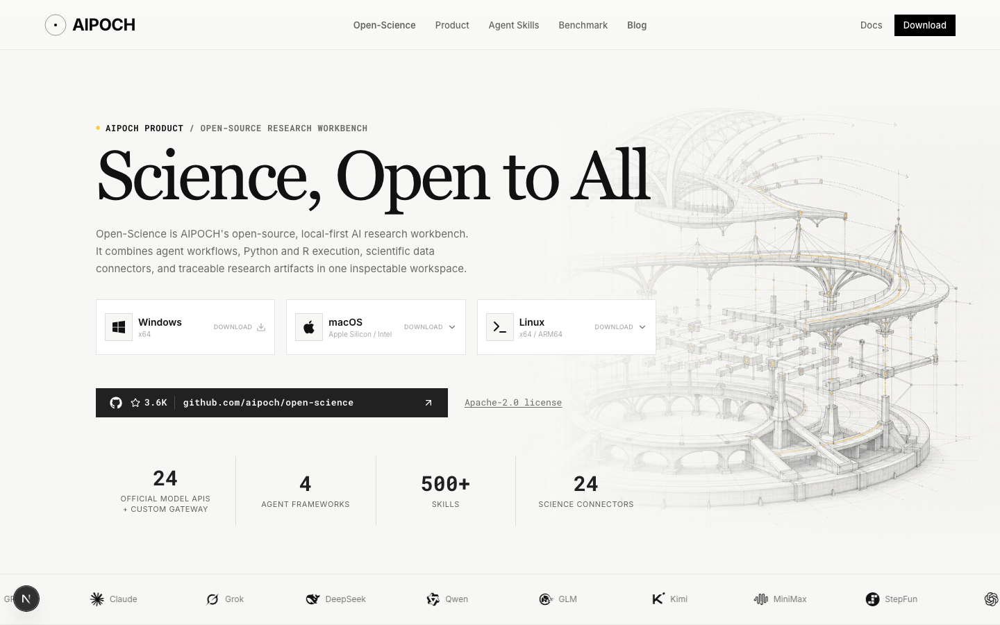
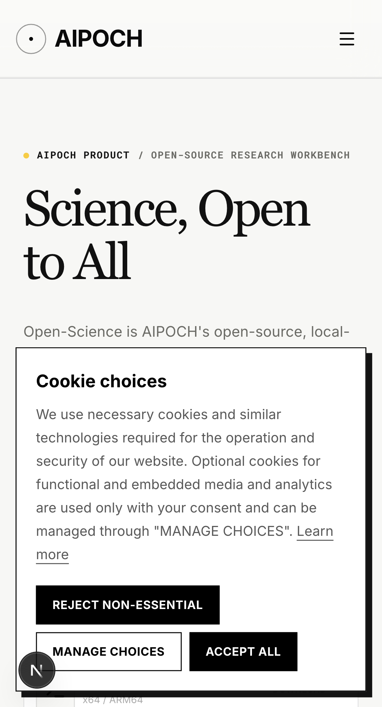

# Landing redesign reconciliation — 2026-10-08

Baseline: `aipoch/aipoch-web` main at `4605b3931a53eef54f406af192fcf63f21f5453e`.
This update merges main into PR #17 without rewriting its original commits.

- Preserve main's Windows downloads and macOS/Linux architecture menus, including Linux ARM64, within the redesigned cards.
- Preserve main's validated Blog publication/video schemas, MedFlow navigation background, and separate Open-Science and Agent Skills resource links.
- Record the reconciled shared layout, homepage layout and Blog article layout as `2026-10-08`. The download page retains its own `2026-09-30` source; shared-layout dates and newer authoritative content dates take precedence. Release and publication dates remain unchanged.
- Sitemap eligibility is unchanged. Affected entries are the root, `/open-science`, `/open-science/download`, `/medflow`, `/agent-skills`, `/agent-skills/list`, `/medskillaudit`, `/blog`, eligible API-provided skill/article URLs, and the three active guides: `/guides/what-is-a-skill`, `/guides/get-started-with-skills`, `/guides/build-your-own-skill`. Wiki dates are untouched. Unit and real mock SSR tests verify dates and exclusions.
- The full diff against main contains no changes to protected build, runtime, deployment or environment configuration.

## Validation

- Frozen dependency install, production build and typecheck passed (local Bun 1.3.13).
- Unit tests: 244 passed.
- Mock integration suite: 14 passed on the completed serial run. An earlier run was interrupted by a concurrent production build clearing `.next`; it is not counted as a pass.
- Homepage, refinements, marquee and scroll-restoration Playwright suites: 48 passed, one intentional mobile TOC skip, and one initial desktop navigation timeout. The failed test passed on an unchanged-code focused rerun; all 49 non-skipped cases have passing results, with the initial timeout retained as a test variability finding.
- Biome check: all 62 changed code files passed. Full repository lint still reports 16 errors, 39 warnings and one schema notice in unchanged files.
- `git diff --check` passed.

## Screenshots

Captured from the reconciled branch using the existing Playwright fixtures.

