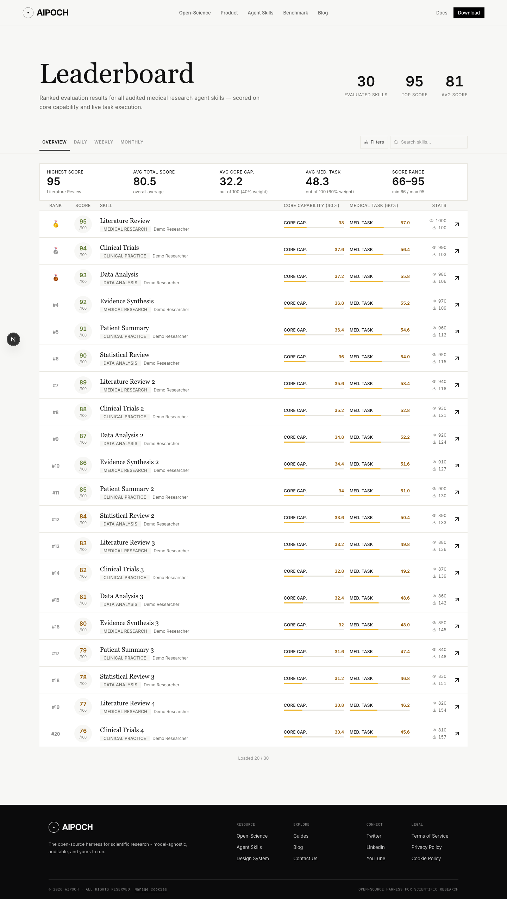


# Leaderboard and Skills reconciliation — 2026-10-08

Baseline: `aipoch/aipoch-web` main at `4605b3931a53eef54f406af192fcf63f21f5453e`, plus the reconciled PR #17 at `b5dafccecc1be78cc26e74d601dcfe99a1fc0422`.
This update preserves the original PR #18 commit and merges the updated prerequisite without rewriting published history. Merge #17 before #18.

The leaderboard, skill details, score panels, filters, pagination, files and download/report destinations retain PR #18's behavior. Main's Linux ARM64 support, MedFlow background and SEO/GEO changes are retained through #17. The shared Figma footer preserves main's separate Open-Science and Agent Skills resource links.

Skill WebPage metadata now includes the shared-layout modification date, matching sitemap output while SoftwareApplication dates remain owned by the API.

## Validation

- Frozen dependency install, production build and typecheck passed (local Bun 1.3.13).
- Unit tests: 246 passed.
- Most recent full `bun run test:mock`: 16 passed, 2 failed (mobile skill-detail timeout and subsequent launcher cleanup exit code). Both failed paths passed in an unchanged-code focused rerun. A previous full run also encountered a desktop leaderboard timeout and cascading failures; that leaderboard case passed in its focused rerun. The full mock suite is not claimed to pass.
- Covered real mock SSR and browser requests include homepage data and installers, Blog content, Skills list/detail/downloads, leaderboard filters/search/pagination and reports, waitlist submission and shared claim state. Desktop/mobile browser Back and restored list state were exercised.
- The SSR regression verifies skill WebPage `dateModified = 2026-10-08` and preserves the fixture SoftwareApplication publication/update dates at `2026-09-01T00:00:00.000Z`.
- Biome check: all 80 changed code files passed. Full repository lint retains 14 errors, 39 warnings and one schema notice in unchanged files.
- `git diff --check` passed. The full diff against main changes no protected build, runtime, deployment or environment configuration.
- Inherited homepage behavior was additionally verified on #17 by 49 non-skipped Playwright cases, with one initial navigation timeout passing on a focused rerun; one mobile TOC case is intentionally skipped.

## Sitemap

Shared-layout, homepage-layout and Blog article layout dates are `2026-10-08`. The existing skill template date remains `2026-09-23`; the later shared-layout date is now included in both skill WebPage metadata and sitemap output. Download-page `2026-09-30` and product release/publication dates remain distinct sources. Newer API timestamps win, and Wiki entries retain their original timestamps.

[sitemap-inventory.csv](sitemap-inventory.csv) lists the 836 concrete URLs observed from the live public sitemap on 2026-10-08: 723 local page URLs and 113 Wiki URLs. The expected-date column records the reconciliation rule applied to those observed values; it is not a claim that a new production sitemap has been deployed or a replacement for authoritative API dates. Sitemap unit tests and real mock SSR output verify the rule, newer content timestamps and exclusions. The prior September inventory remains historical evidence.

The affected local URL set includes the homepage, Open-Science and downloads, MedFlow, Agent Skills and its list/details, MedSkillAudit, Blog and articles, and the three active guide URLs. Leaderboards, redirect-only guide index, private claims, retired routes and standalone presentations remain excluded.

## Current screenshots

Captured from the reconciled branch using deterministic mock data.

