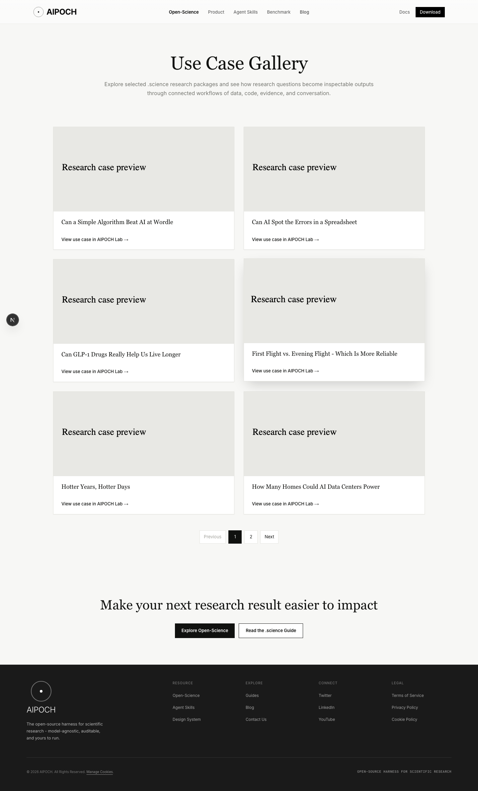
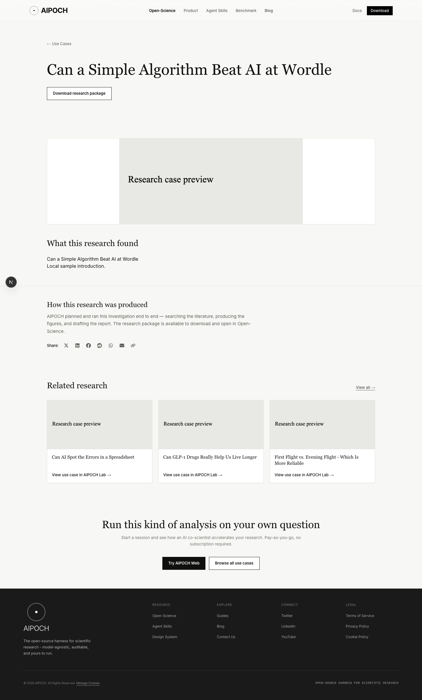
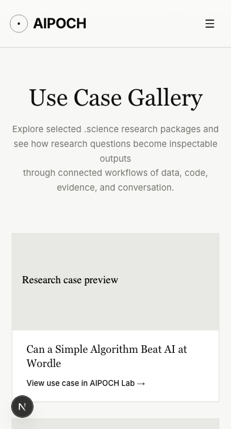

# Use-case manifest preview

Captured on 2026-10-08 using `bun run dev:mock` with ephemeral local ports.
The gallery uses the supplied nine-case manifest. Covers and introductions are
local mock samples, not downloaded production assets. The S3 URL remains unset.
The screenshots include the Next.js development indicator.

## Desktop gallery

## Desktop detail

## Mobile gallery

